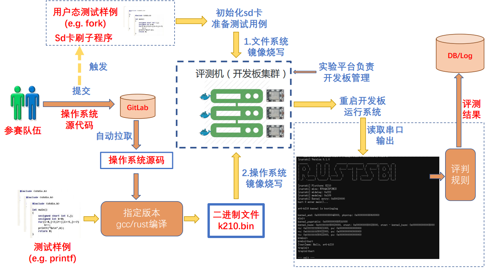

## 测试

测试程序有提供两个步骤：一是将源码编译成可执行文件，可以自己配看本地效果。二是把这个文件复制在官方提供的标准os跑，看效果。当然最终都是要提交到测试平台去做测试。

#### 生成测试文件

将交叉编译链（用k210官方提供的）的路径放在path中，然后运行user文件下的build脚本（也可以在makefile中更改一些参数跑单个用例）。该脚本就是调用makefile指令，然后使用cmake来建立对应的文件，再实现一些文件的移动操作。

#### 官方示例

官方示例将自己准备文件系统的镜像，然后用虚拟机（riscv linux）跑自己的文件系统（里头含有测试文件）。

运行make的时候会出现一些问题，首先是linux很大，需要保证足够的build空间，还有就是缺少src/riscv-pk（berkeley bootloader），需要在github上下载下来。

在虚拟机跑起来后，就可以用下面命令来登录它。

>ssh root@192.168.100.2

之后就可以用对应的账户密码登录对应的qemu虚拟机，将对应的文件系统挂载到.mnt上，在交叉编译完测试用例之后（这个需要自己编译完得到结果），通过scp程序将其传入qemu虚拟机，就可以开始跑了。

#### 如何在UltraOS上运行

##### 运行测试程序

测试程序都已经放在了SD卡中的FAT32文件系统之中。一共有两种文件：可执行文件和sh文件。这就以为着我们必须还要额外支持sh文件的shell命令解析。sh文件有两个：

##### 测试流程

从这里可以看出评判系统的评判是被动评判，评判系统不会有串口的输入，程序必须自行运行所有的测试程序，这意味着UltraOS需要自行导入与测试程序无关的初始程序，以便能够运行接下来的程序。同时，在运行完所有的程序之后，关机。

##### 完整的适配评测系统的流程

将shell和init_proc两个程序放在内存中，操作系统一运行，先不打开双核（假设我们是双核方案），然后加载初始进程，将初始进程加载后开始运行（同时放行另一个核）。它自身会加载shell，但是我们在exec判断是shell后不从文件系统寻找对应程序而是从内存把shell加载进来。

shell程序的设定也有改变，不会再等待串口（设置一个常量，评测系统里用就不等待串口，否则还是等待用户的输入）。Shell machine将直接导入run-all.sh 的sh解析，然后解析出对应的指令，并执行。

##### EXT2文件系统运行测试样例

由于给定的测试要求在FAT32文件系统中使用，但是当前的设计仅仅是EXT2，在文件系统没有经过完整的测试的情况之下，我们需要先将其移植至EXT2中，让其能够很好的兼容，先运行相应的程序。

#### Shell

从评测系统的要求看来，虽然不要求实现重定向，但是却要求支持shell变量存储。这样做的工作量飞铲大噶，步子迈大了，我们直接手动实现对应的要求，也就是在shell防止一个命令，直接初始就按照shell命令所示，运行所有的程序。

